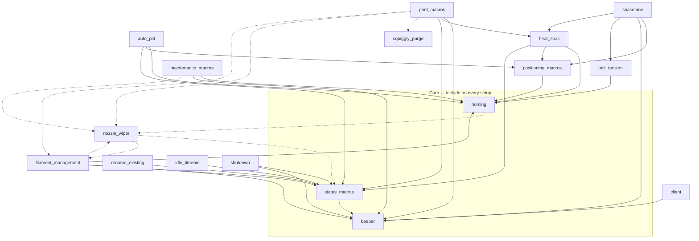

# Macro Cross-File Dependencies

How the `.cfg` files in [`macros/`](../macros/) depend on one another, and which
dependencies are mandatory versus optional. Use this to decide what to `[include]` in
your `printer.cfg`.

## Two kinds of coupling

- **Required** — File A calls a macro/variable from File B **unguarded**. If B is not
  included, the macro **errors when it runs**. Klipper renders macro bodies at call
  time, so this surfaces as `Unknown command` _while the macro executes_ — not at
  config load. The printer still boots; the feature fails when used.
- **Optional** — The usage is gated by ``
  (or a `printer.configfile.settings` check). If B is absent, A falls back to default
  behavior with no error. This is an enhancement, not a requirement.

> **Note**:
>
> Native Klipper commands (`TURN_OFF_HEATERS`, `M117`, `M84`, `QUAD_GANTRY_LEVEL`, …)
> are **not** dependencies on [`rename_existing.cfg`](rename_existing.md). That file
> only _wraps_ the built-ins to add status signaling — the built-ins still exist when
> it is absent, so calling them never errors.

## The core trio

Almost every file requires at least one of these, so include all three on any setup:

- [`status_macros.cfg`](status_macros.md) — `STATUS_*`, `RESET_STATUS`
- [`homing.cfg`](homing.md) — `_CG28` conditional homing
- [`beeper.cfg`](beeper.md) — `M300` and chime helpers

Fully standalone (no in-repo dependencies, safe to include or omit on their own):
[`beeper.cfg`](beeper.md), [`squiggly_purge.cfg`](squiggly_purge.md),
[`tacho_macros.cfg`](tacho_macros.md), [`gcode_features.cfg`](gcode_features.md),
[`save_config.cfg`](save_config.md).

## Dependency graph

Solid arrow = **required** (`A --> B` means "A requires B"). Dashed arrow = **optional**
(auto-detected, graceful fallback). External systems are listed in the table below, not
the graph.

> **Note**:
>
> [`status_macros.cfg`](status_macros.md) also optionally invokes `_CG28`, `CENTER`,
> `HEAT_SOAK`, `CLEAN_NOZZLE`, and `PRINT_END` — but only from its developer
> `TEST_STATUS_MACROS` macro, each behind an `is defined` guard. Those edges are
> omitted from the graph to keep it readable.

There are **no required circular dependencies**. The only cycles
(`status_macros ↔ nozzle_wiper`, `status_macros ↔ heat_soak`/`print_macros`) lie
entirely on dashed/optional edges and are therefore safe.

## Per-file table

| File                                              | Required in-repo                                    | Optional in-repo                                                          | External (guarded unless noted)                                                                             |
| ------------------------------------------------- | --------------------------------------------------- | ------------------------------------------------------------------------- | ----------------------------------------------------------------------------------------------------------- |
| [auto_pid.cfg](auto_pid.md)                       | homing, positioning_macros, status_macros           | —                                                                         | —                                                                                                           |
| [beeper.cfg](beeper.md)                           | —                                                   | —                                                                         | —                                                                                                           |
| [belt_tension.cfg](belt_tension.md)               | homing                                              | —                                                                         | QUAD_GANTRY_LEVEL                                                                                           |
| [client.cfg](client.md)                           | beeper                                              | —                                                                         | AFC                                                                                                         |
| [filament_management.cfg](filament_management.md) | homing, status_macros, beeper                       | nozzle_wiper                                                              | **Mainsail/Fluidd client `_CLIENT_EXTRUDE`/`_CLIENT_RETRACT` — required (unguarded)**; AFC                  |
| [gcode_features.cfg](gcode_features.md)           | —                                                   | —                                                                         | —                                                                                                           |
| [heat_soak.cfg](heat_soak.md)                     | homing, positioning_macros, status_macros           | —                                                                         | —                                                                                                           |
| [homing.cfg](homing.md)                           | status_macros                                       | nozzle_wiper                                                              | —                                                                                                           |
| [idle_timeout.cfg](idle_timeout.md)               | status_macros                                       | —                                                                         | AFC                                                                                                         |
| [maintenance_macros.cfg](maintenance_macros.md)   | homing, beeper                                      | nozzle_wiper                                                              | AFC                                                                                                         |
| [nozzle_wiper.cfg](nozzle_wiper.md)               | —                                                   | status_macros, filament_management                                        | KAMP                                                                                                        |
| [positioning_macros.cfg](positioning_macros.md)   | homing                                              | —                                                                         | —                                                                                                           |
| [print_macros.cfg](print_macros.md)               | beeper, heat_soak, status_macros                    | squiggly_purge, nozzle_wiper, filament_management                         | **KAMP `LINE_PURGE` — required purge fallback (unguarded)**; Mainsail/Fluidd `_CLIENT_EXTRUDE`; Beacon; AFC |
| [rename_existing.cfg](rename_existing.md)         | status_macros                                       | —                                                                         | wraps native G-code (safe)                                                                                  |
| [save_config.cfg](save_config.md)                 | —                                                   | —                                                                         | —                                                                                                           |
| [shaketune.cfg](shaketune.md)                     | positioning_macros, beeper, belt_tension, heat_soak | —                                                                         | **Shake&Tune — required (unguarded)**                                                                       |
| [shutdown.cfg](shutdown.md)                       | status_macros, beeper                               | —                                                                         | —                                                                                                           |
| [squiggly_purge.cfg](squiggly_purge.md)           | —                                                   | —                                                                         | —                                                                                                           |
| [status_macros.cfg](status_macros.md)             | —                                                   | beeper, homing, nozzle_wiper, positioning_macros, heat_soak, print_macros | —                                                                                                           |
| [tacho_macros.cfg](tacho_macros.md)               | —                                                   | —                                                                         | —                                                                                                           |

## External systems

These come from outside this repo. Most are detected with `is defined` guards and are
truly optional, but a few are called **unguarded** and therefore behave as hard
requirements of the files that use those code paths:

| System                                                               | Used by                                                                            | Status                                                                                                                                                          |
| -------------------------------------------------------------------- | ---------------------------------------------------------------------------------- | --------------------------------------------------------------------------------------------------------------------------------------------------------------- |
| Klipper core (`QUAD_GANTRY_LEVEL`, `BED_MESH_*`, `SMART_PARK`)       | print_macros, belt_tension, status_macros                                          | Optional (guarded)                                                                                                                                              |
| Mainsail `_CLIENT_VARIABLE`                                          | filament_management, client                                                        | Optional (guarded)                                                                                                                                              |
| Mainsail/Fluidd client config (`mainsail.cfg` / `fluidd.cfg`)        | filament_management.cfg, print_macros.cfg                                          | **Effectively required** — `_CLIENT_EXTRUDE`/`_CLIENT_RETRACT` are called unguarded; standard on any Mainsail/Fluidd install (also provides `_CLIENT_VARIABLE`) |
| AFC (Armored Filament Changer)                                       | print_macros, filament_management, client, idle_timeout, maintenance, nozzle_wiper | Optional (guarded)                                                                                                                                              |
| Beacon probe                                                         | print_macros, save_config                                                          | Optional (guarded)                                                                                                                                              |
| [KAMP](https://github.com/kyleisah/Klipper-Adaptive-Meshing-Purging) | print_macros.cfg, nozzle_wiper.cfg                                                 | **`LINE_PURGE` purge fallback is unguarded** (required if that branch runs); `_KAMP_Settings` reads are guarded                                                 |
| [Shake&Tune](https://github.com/Frix-x/klippain-shaketune)           | shaketune.cfg                                                                      | **Required** for that file (unguarded)                                                                                                                          |

> **Warning**:
>
> Two external couplings are stronger than "optional" because they are called without
> an `is defined` guard:
>
> - `filament_management.cfg`'s `_CONDITIONAL_RETRACT`/`_CONDITIONAL_UNRETRACT` (and a
>   prime step in `print_macros.cfg`) call `_CLIENT_EXTRUDE`/`_CLIENT_RETRACT` from the
>   **Mainsail/Fluidd client config** (`mainsail.cfg` / `fluidd.cfg`). These ship with
>   any Mainsail/Fluidd install, so this is rarely a problem in practice — but the file
>   does require that client config to be included.
> - `print_macros.cfg`'s purge fallback calls **KAMP**'s `LINE_PURGE` unguarded.
>
> Without the providing config included, those paths raise `Unknown command` when they
> execute.

---

See the `.cfg` file headers for the same dependency notes per file, and
[dev/MACRO_STYLE_GUIDE.md](dev/MACRO_STYLE_GUIDE.md#dependency-notes-required) for the
convention that keeps them in sync.
